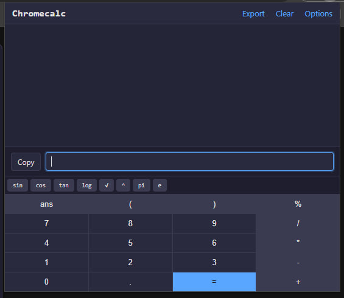

# Chromecalc 🚀

**A powerful, feature-rich calculator extension for your browser, built with Vibecoding and AI synergy.**  

---

 

TG: https://t.me/Synthread/15

## Key Features / Ключевые возможности

Chromecalc is more than just a calculator. It's a smart tool designed for everyday calculations, financial planning, and educational purposes.

| Feature                    | Description                                                                                                                              |
| -------------------------- | ---------------------------------------------------------------------------------------------------------------------------------------- |
| 📊 **Function Plotting**       | Visualize functions directly in the calculator using a simple command: `plot(x^2, [-10, 10])`.                                            |
| 💸 **Mixed Currency Calcs**    | Perform calculations with multiple currencies and numbers in one line, like `100 USD - 25 + 1500 RUB`. Uses live exchange rates.             |
| 📝 **Inline Comments**         | Keep your calculations organized by adding notes right inside them: `3600//rent// + 500//internet//`.                                     |
| 🔢 **On-Screen Keypad**        | Use a classic calculator interface with buttons for numbers, operators, and your own custom variables. Can be enabled in the options.    |
| ⚙️ **Custom Logic**            | Define your own variables (`a=5`) and functions (`f(x)=x^2`) that are saved and synced across devices.                                   |
| ％ **Percentage Support**      | Correctly handles percentage calculations like `100 + 10%` (equals 110) and `50 * 20%` (equals 10).                                       |
| 🔄 **Cross-Device Sync**       | Optionally sync your history, settings, and custom functions/constants across all your devices via your Google Account.                  |
| 🎨 **Themes & Localization** | Switch between Light and Dark themes, and choose between English and Russian interfaces.                                                 |

## Installation / Установка

#### From Chrome Web Store / Из магазина Chrome
_(Coming soon! / Скоро!)_

#### Manual Installation / Ручная установка

1.  **Download:** Download the latest version by clicking `Code` -> `Download ZIP` on this GitHub page and unzip the archive.  
    _**Скачайте:** Скачайте последнюю версию, нажав `Code` -> `Download ZIP` на этой странице, и распакуйте архив._

2.  **Open Extensions Page:** Open Chrome and navigate to `chrome://extensions`.  
    _**Откройте страницу расширений:** Откройте Chrome и перейдите по адресу `chrome://extensions`._

3.  **Enable Developer Mode:** Turn on the **Developer mode** toggle in the top right corner.  
    _**Включите режим разработчика:** Активируйте переключатель **Режим разработчика** в правом верхнем углу._

4.  **Load the Extension:** Click the **Load unpacked** button and select the entire `Chromecalc` folder.  
    _**Загрузите расширение:** Нажмите **Загрузить распакованное расширение** и выберите всю папку `Chromecalc`._

5.  **Done!** The Chromecalc icon will appear on your Chrome toolbar.  
    _**Готово!** Иконка Chromecalc появится на панели инструментов._

## How to Use / Как использовать

Most functions are intuitive, but here are some special commands:

-   **Plotting:** `plot(sin(x), [-pi, pi])`
-   **Currency Conversion:** `15 USD in EUR`
-   **Mixed Currency Math:** `100 EUR - 20 + 500 RUB`
-   **Comments:** `4500//salary// - 1200//taxes//`
-   **Percentages:** `15000 - 13%`
-   **Create a variable:** `myVar = 15 * 4`

## Technology Stack / Технологический стек

-   HTML5, CSS3, JavaScript (ES6+)
-   Chrome Extension Manifest V3
-   [Math.js](https://mathjs.org/) - For the powerful math engine.
-   [Chart.js](https://www.chartjs.org/) - For function plotting.

## License / Лицензия

This project is licensed under the MIT License - see the [LICENSE](LICENSE) file for details.
